# End-to-End Referring Video Object Segmentation with Multimodal Transformers

***

## 💡 Meta Data

| Title     | End-to-End Referring Video Object Segmentation with Multimodal Transformers                                                                                                     |
| -------------------------------------------------------- | ------------------------------------------------------------------------------------------------------------------------------------------------------------------------------------------------------------------------------ |
| Journal   |                                                                                                                                                                                                                                |
| Authors   | Adam Botach; Evgenii Zheltonozhskii; Chaim Baskin                                                                                                                               |
| Pub. date | 2022-04-03                                                                                                                                                                      |
| 期刊标签      |                                                                                                                                                                                                                                |
| DOI       | <a href="https://doi.org/10.48550/arXiv.2111.14821" rel="noopener noreferrer nofollow">10.48550/arXiv.2111.14821</a>                                                            |
| 附件        | <a href="zotero://open-pdf/0_V5DTLZNT" rel="noopener noreferrer nofollow">Botach et al_2022_End-to-End Referring Video Object Segmentation with Multimodal Transformers.pdf</a> |

## 📜 研究背景 &#x26; 基础 &#x26; 目的

***

<a href="zotero://open-pdf/library/items/V5DTLZNT?page=NaN">“Referring video object segmentation.”</a> (<a href="zotero://select/library/items/JJNC6MMR">Botach 等, 2022, p. 1</a>) 参考视频对象分割

<a href="zotero://open-pdf/library/items/V5DTLZNT?page=NaN">“Transformers.”</a> (<a href="zotero://select/library/items/JJNC6MMR">Botach 等, 2022, p. 2</a>) 介绍Transformer

## 📌 研究贡献

***

### MTTR

<a href="zotero://open-pdf/library/items/V5DTLZNT?page=NaN">“We present a Transformer-based RVOS framework, dubbed Multimodal Tracking Transformer (MTTR), which models the task as a parallel sequence prediction problem and outputs predictions for all objects in the video prior to selecting the one referred to by the text.”</a> (<a href="zotero://select/library/items/JJNC6MMR">Botach 等, 2022, p. 2</a>) 我们提出了一个基于Transformer的 RVOS 框架，称为多模态跟踪Transformer (MTTR)，它将任务建模为并行序列预测问题，并在选择文本所指的对象之前输出视频中所有对象的预测结果。

### Temporal segment voting scheme

<a href="zotero://open-pdf/library/items/V5DTLZNT?page=NaN">“Our sequence selection strategy is based on a temporal segment voting scheme, a novel reasoning scheme that allows our model to focus on more relevant parts of the video with regards to the text.”</a> (<a href="zotero://select/library/items/JJNC6MMR">Botach 等, 2022, p. 2</a>) 我们的序列选择策略基于时间片段投票方案，这是一种新颖的推理方案，可让我们的模型关注视频中与文本更相关的部分。

### End-to-end trainable

<a href="zotero://open-pdf/library/items/V5DTLZNT?page=NaN">“The proposed method is end-to-end trainable, free of text-related inductive bias modules, and requires no additional mask refinement.”</a> (<a href="zotero://select/library/items/JJNC6MMR">Botach 等, 2022, p. 2</a>) 所提出的方法是端到端可训练的，不存在与文本相关的归纳偏差模块，也不需要额外的掩码改进。

## 📊 研究内容

***

#### Tsak definition

1.  <a href="zotero://open-pdf/library/items/V5DTLZNT?page=3">“The input of RVOS consists of a frame sequence V = {vi}iT=1, where vi ∈ RC×H0×W0 , and a text query T = {ti}iL=1, where ti is the ith word in the text.”</a>

    (<a href="zotero://select/library/items/JJNC6MMR">Botach 等, 2022, p. 3</a>)

    V为单帧视频信息；T为文本信息，其中ti为第i个单词。

2.  <a href="zotero://open-pdf/library/items/V5DTLZNT?page=NaN">“Then, for a subset of frames of interest VI ⊆ V of size TI, the goal is to segment the object referred by T in each frame in VI.”</a>

    (<a href="zotero://select/library/items/JJNC6MMR">Botach 等, 2022, p. 3</a>)

    然后，对于大小为 T_I 的感兴趣帧子集 V_I ⊆ V，目标是分割 V_I 中每个帧中 T 所指的对象。

#### Feature extraction

<a href="zotero://open-pdf/library/items/V5DTLZNT?page=NaN">“deep spatio-temporal encoder.”</a> (<a href="zotero://select/library/items/JJNC6MMR">Botach 等, 2022, p. 3</a>) 首先使用deep spation-temproal encoder提取V中的每一帧图像的特征

<a href="zotero://open-pdf/library/items/V5DTLZNT?page=3">“Transformer-based [42] text encoder.”</a> (<a href="zotero://select/library/items/JJNC6MMR">Botach 等, 2022, p. 3</a>) 同时使用Transformer based encoder 提取文本特征

<a href="zotero://open-pdf/library/items/V5DTLZNT?page=3">“inearly projected to a shared dimension D”</a> (<a href="zotero://select/library/items/JJNC6MMR">Botach 等, 2022, p. 3</a>) 将两个提取的特征线性投影到D

#### Instnce prediction

<a href="zotero://open-pdf/library/items/V5DTLZNT?page=NaN">“TI”</a> (<a href="zotero://select/library/items/JJNC6MMR">Botach 等, 2022, p. 3</a>) 对每个相关帧的特征进行扁平化处理，并分别与文本嵌入进行连接，生成一组 T\_I 多模态序列

<a href="zotero://open-pdf/library/items/V5DTLZNT?page=NaN">“exchange information”</a> (<a href="zotero://select/library/items/JJNC6MMR">Botach 等, 2022, p. 3</a>) 互通信息

<a href="zotero://open-pdf/library/items/V5DTLZNT?page=NaN">“Then, the decoder layers, which are fed with Nq object queries per input frame, query the multimodal sequences for entity-related information and store it in the object queries.”</a> (<a href="zotero://select/library/items/JJNC6MMR">Botach 等, 2022, p. 3</a>) 解码器层在每个输入帧中输入 Nq 个对象查询，查询多模态序列中与实体相关的信息，并将其存储在对象查询中。

视频中的每一帧共享训练权重，以查询到相同的instance sequence

#### Output generation

使用FPN和动态生成的条件卷积核生成相应的mask

<a href="zotero://open-pdf/library/items/V5DTLZNT?page=NaN">“novel text-reference score function”</a> (<a href="zotero://select/library/items/JJNC6MMR">Botach 等, 2022, p. 4</a>) 新颖的文本参考评分函数 用此函数来确定对象查询序列与描述对象是否具有强关联性。

#### Multimodal Transformer

对于每个感兴趣的帧，时间编码器生成一个特征图

$$
f_t^{\mathcal{V}_{\mathcal{I}}} \in \mathbb{R}^{H \times W \times C_{\mathcal{V}}}
$$

文本编码器输出语言嵌入向量

$$
f_{\mathcal{T}} \in \mathbb{R}^{L \times D_{\mathcal{T}}}
$$

## 🔬 理论推导

***

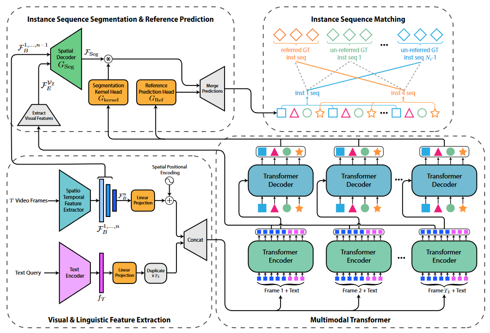

### <a href="zotero://open-pdf/library/items/V5DTLZNT?page=NaN">“The Instance Segmentation Process”</a> (<a href="zotero://select/library/items/JJNC6MMR">Botach 等, 2022, p. 4</a>) 实例分割过程。

   给定最后一个Transformer输出的$F_E$ 提取每个序列中和视频相关的部分并将其重塑为$\mathcal{F}_E^{\mathcal{V}_{\mathcal{I}}}$ 将temporal encoder 的前n-1个输出为$\mathcal{F}_B^{\mathcal{1,...,n-1}}$ 通过类似于FPN的spatial decoder将$G_{Seg}$ 进行分层融合。产生语义丰富的高分辨率视频帧特征图$\mathcal{F}_{Seg}$  

$$
\mathcal{F}_{\text {Seg }}=\left\{f_{\text {Seg }}^t\right\}_{t=1}^{T_{\mathcal{I}}}, f_{\text {Seg }}^t \in \mathbb{R}^{D_s \times \frac{H_0}{4} \times \frac{W_0}{4}}

$$

使用双层感知器生成条件分割序列

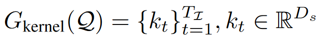

将每个分割核与其对应的帧特征进行卷积，生成mask ，双线性上采样，将mask调整为grund-truth分辨率。

### <a href="zotero://open-pdf/library/items/V5DTLZNT?page=NaN">“Instance Sequence Matching”</a> (<a href="zotero://select/library/items/JJNC6MMR">Botach 等, 2022, p. 4</a>) 实例序列匹配

首先寻找搜索成本最低的排序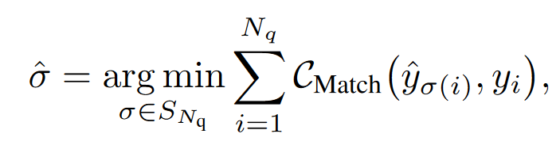其中，CMatch 是成对匹配成本。使用匈牙利算法可以高效计算。每个地面实况序列的形式为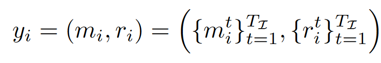使用一个参考预测头（用$ G_{Ref}$表示），它由一个形状为 D × 2 的线性层和一个 softmax 层组成。给定预测对象查询 q∈$\mathbb{R}^D$ 后，该预测头将 q 作为输入，并输出参考预测结果$\hat{r} \equiv G_{\mathrm{Ref}}(q)$。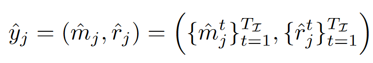

匹配函数成本为以下函数总和

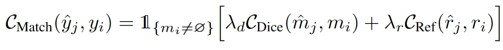

CRef 利用相应的地面实况序列对参考预测进行监督，具体如下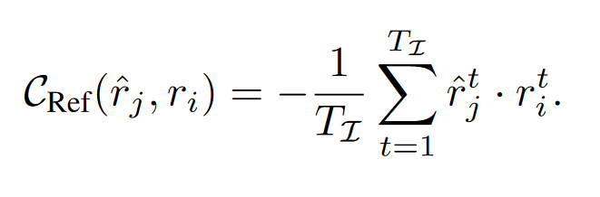

### <a href="zotero://open-pdf/library/items/V5DTLZNT?page=NaN">“Loss Functions”</a> (<a href="zotero://select/library/items/JJNC6MMR">Botach 等, 2022, p. 5</a>) 损失函数

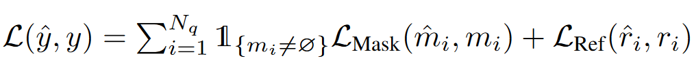

#### L\_mask被定义为Dice和每个像素Focal损失函数的组合

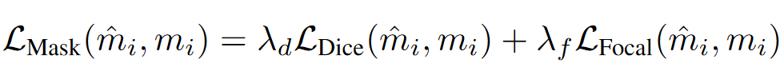

L\_Dice 和 L\_Focal 在每个时间步长都会应用于相应的掩码，并根据训练批次中的实例数量进行归一化处理。

#### L\_Ref为交叉熵用于监督序列参考预测

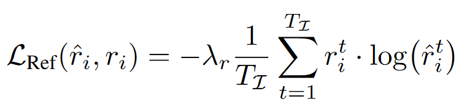

### <a href="zotero://open-pdf/library/items/V5DTLZNT?page=NaN">“Inference”</a> (<a href="zotero://select/library/items/JJNC6MMR">Botach 等, 2022, p. 5</a>)

#### 输出R

#### 给定参考预测值的positive类别概率

#### 返回分段掩码序列和其得分

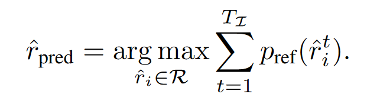

将这种序列选择方案称为 "时间片段投票方案"（TSVS），它根据每个预测序列的术语与文本所指对象的总关联度对其进行分级。

## 🚩 实验结果

***

### 数据集

<a href="zotero://open-pdf/library/items/V5DTLZNT?page=5">“A2D-Sentences and JHMDB-Sentences”</a> (<a href="zotero://select/library/items/JJNC6MMR">Botach 等, 2022, p. 5</a>)在数据集上添加文本注释

<a href="zotero://open-pdf/library/items/V5DTLZNT?page=6">“ReferYouTube-VOS dataset”</a> (<a href="zotero://select/library/items/JJNC6MMR">Botach 等, 2022, p. 6</a>)每段视频每五帧都有像素级实例分割注释。

### 精度估计方法

<a href="zotero://open-pdf/library/items/V5DTLZNT?page=6">“We adopt Overall IoU, Mean IoU, and precision@K to evaluate our method on these datasets.”</a> (<a href="zotero://select/library/items/JJNC6MMR">Botach 等, 2022, p. 6</a>)我们在这些数据集上采用总体 IoU、平均 IoU 和精度@K 来评估我们的方法。

<a href="zotero://open-pdf/library/items/V5DTLZNT?page=6">“Overall IoU computes the ratio between the total intersection and the total union area over all the test samples.”</a> (<a href="zotero://select/library/items/JJNC6MMR">Botach 等, 2022, p. 6</a>)总体 IoU 计算的是所有测试样本的总交叉面积与总结合面积之间的比率。

<a href="zotero://open-pdf/library/items/V5DTLZNT?page=6">“Mean IoU is the averaged IoU over all the test samples.”</a> (<a href="zotero://select/library/items/JJNC6MMR">Botach 等, 2022, p. 6</a>)

<a href="zotero://open-pdf/library/items/V5DTLZNT?page=6">“Precision@K considers the percentage of test samples whose IoU scores are above a threshold K, where K ∈ [0.5, 0.6, 0.7, 0.8, 0.9].”</a> (<a href="zotero://select/library/items/JJNC6MMR">Botach 等, 2022, p. 6</a>)

<a href="zotero://open-pdf/library/items/V5DTLZNT?page=6">“The primary evaluation metrics for this dataset are the average of the region similarity (J ) and the contour accuracy (F) [35].”</a> (<a href="zotero://select/library/items/JJNC6MMR">Botach 等, 2022, p. 6</a>)该数据集的主要评估指标是区域相似度（J）和轮廓精度（F）的平均值 \[35]。

### 具体实施

#### 预训练

我们使用最小的（"微小"）视频 Swin 变换器 \[28] 作为时态编码器，并在 Kinetics-400 \[17] 上进行了预训练。只用swin transformer的前三个区块 第三个区块作为多模态transformer

#### 参数

w=8/w=12

320×576/360×640

#### 比较

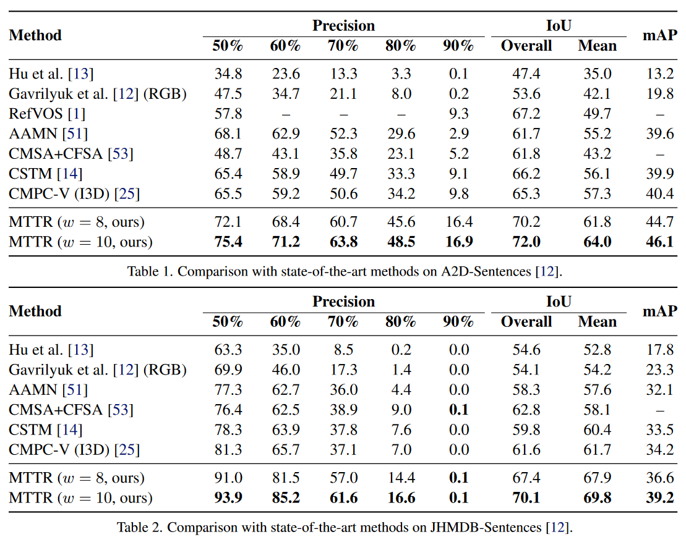
